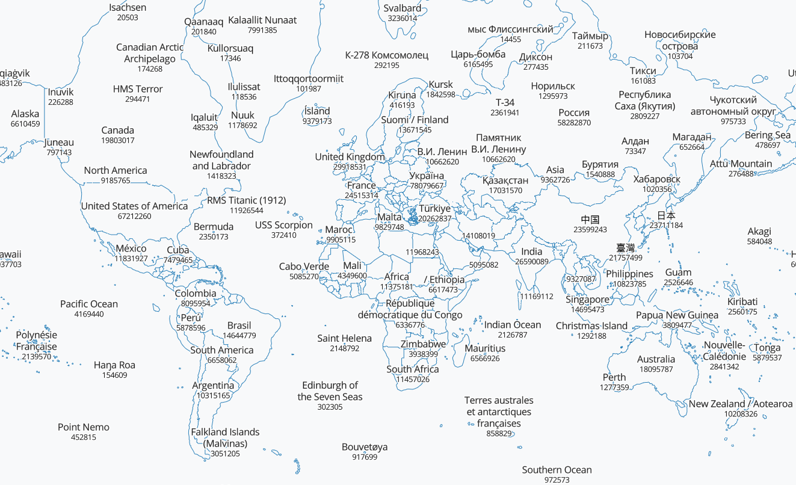

# QRank Map

A map where OpenStreetMap labels are weighted according to their [QRank](https://qrank.wmcloud.org).

OpenStreetMap entries often have a `wikidata=Q*` tag which links the entry to Wikidata of Wikipedia. QRank is a system which measures how often a Wikipedia page associated with a Wikidata entry was loaded in the last year, thereby indicating how important something is.

## Demo



<i>Screenshot of the QRank Map in Switzerland shows the label names and QRanks. Geneva seems to be the most important OpenStreetMap entry for Switzerland...</i>

## Generating the Tiles

We use [Planetiler](https://github.com/onthegomap/planetiler) to generate the QRank map tiles and serve them as [PMTiles](https://github.com/protomaps/PMTiles) on GitHub Pages.

First, clone Planetiler on Ubuntu (at commit `2340516`)

```
git clone https://github.com/onthegomap/planetiler.git
```

Download the QRank file (97 MB)

```
cd planetiler/planetiler-examples/src/main/java/com/onthegomap/planetiler/examples
wget https://qrank.wmcloud.org/download/qrank.csv.gz
gzip -d qrank.csv.gz
cd -
```

Create a new file called `planetiler/planetiler-examples/src/main/java/com/onthegomap/planetiler/examples/QRank.java` and fill it with:

```java
package com.onthegomap.planetiler.examples;

import com.onthegomap.planetiler.FeatureCollector;
import com.onthegomap.planetiler.Planetiler;
import com.onthegomap.planetiler.Profile;
import com.onthegomap.planetiler.config.Arguments;
import com.onthegomap.planetiler.reader.SourceFeature;
import com.onthegomap.planetiler.util.ZoomFunction;
import java.nio.file.Path;
import java.io.BufferedReader;
import java.io.FileReader;
import java.util.HashMap;

public class QRank implements Profile {
  static HashMap<String, String> qranks;

  public static void main(String[] args) throws Exception {
    run(Arguments.fromArgsOrConfigFile(args));
  }

  static void run(Arguments inArgs) throws Exception {
    qranks = new HashMap<String, String>();

    System.out.println("Start reading qrank.csv...");
    BufferedReader reader;
    reader = new BufferedReader(new FileReader("src/main/java/com/onthegomap/planetiler/examples/qrank.csv"));
    String line = reader.readLine();
    while (line != null) {
      String[] parts = line.split(",");
      qranks.put(parts[0].trim(), parts[1].trim());
      line = reader.readLine();
    }
    reader.close();

    var args = inArgs.orElse(Arguments.of(
      "minzoom", 0,
      "maxzoom", 9,
      "tile_warning_size_mb", 100
    ));
    String area = args.getString("area", "geofabrik area to download", "monaco");
    Planetiler.create(args)
      .setProfile(new QRank())
      .addOsmSource("osm",
        Path.of("data", "sources", area + ".osm.pbf"),
        "planet".equalsIgnoreCase(area) ? "aws:latest" : ("geofabrik:" + area)
      )
      .overwriteOutput("mbtiles", Path.of("data", "qrank.mbtiles"))
      .run();
  }

  static int getQRank(Object wikidata) {
    String qrank = qranks.get(wikidata.toString());
    if (qrank == null) {
      return 0;
    }
    else {
      return Integer.parseInt(qrank);
    }
  }

  @Override
  public void processFeature(SourceFeature sourceFeature, FeatureCollector features) {
    if (sourceFeature.isPoint() && sourceFeature.hasTag("wikidata") && sourceFeature.hasTag("name"))
    {
      features.point("qrank")
        .setZoomRange(0, 9)
        .setSortKey(-getQRank(sourceFeature.getTag("wikidata")) / 100)
        .setPointLabelGridSizeAndLimit(
          12, // only limit at z12 and below
          32, // break the tile up into 32x32 px squares
          4 // any only keep the 4 nodes with lowest sort-key in each 32px square
        )
        .setBufferPixelOverrides(ZoomFunction.maxZoom(12, 32))
        .setAttr("name", sourceFeature.getTag("name"))
        .setAttr("@qrank", getQRank(sourceFeature.getTag("wikidata")));
    }
    if (sourceFeature.canBeLine() && sourceFeature.hasTag("boundary", "administrative") && sourceFeature.hasTag("admin_level")) {
      if (sourceFeature.hasTag("admin_level", "2")) {
        features.line("boundary-admin-2")
          .setZoomRange(0, 7)
          .setMinPixelSize(0);
      }
      if (sourceFeature.hasTag("admin_level", "4")) {
        features.line("boundary-admin-4")
          .setZoomRange(7, 7)
          .setMinPixelSize(0);
      }
    }
  }

  @Override
  public String name() {
    return "osm qrank";
  }

  @Override
  public String attribution() {
    return """
      <a href="https://www.openstreetmap.org/copyright" target="_blank">&copy; OpenStreetMap contributors</a>
      """.trim();
  }
}
```

Compile Planetiler

```
cd planetiler/planetiler-examples
../mvnw clean package --file standalone.pom.xml
```

Run Planetiler

```
cd planetiler/planetiler-examples
java -cp target/*-with-deps.jar com.onthegomap.planetiler.examples.QRank \
  --download --area=planet --bounds=world \
  --download-threads=10 --download-chunk-size-mb=1000 \
  --fetch-wikidata \
  --nodemap-type=array --storage=mmap -Xmx32g 2>&1 | tee logs.txt
```

This will run Planetiler on the full planet. On a 12 core, 128 GB machine this took 15 minutes without downloading the input files.

Inpect the generated tiles with [tileserver-gl](https://github.com/maptiler/tileserver-gl)

```
cd planetiler/planetiler-examples
docker run --rm -it -v "$(pwd)/data":/data -p 8080:8080 maptiler/tileserver-gl -p 8080
```

Convert the tiles from `qrank.mbtiles` to `qrank.pmtiles` with

```
cd planetiler/planetiler-examples
wget https://github.com/protomaps/go-pmtiles/releases/download/v1.6.2/go-pmtiles_1.6.2_Linux_x86_64.tar.gz
tar xzvf go-pmtiles_1.6.2_Linux_x86_64.tar.gz
./pmtiles convert data/qrank.mbtiles data/qrank.pmtiles
```